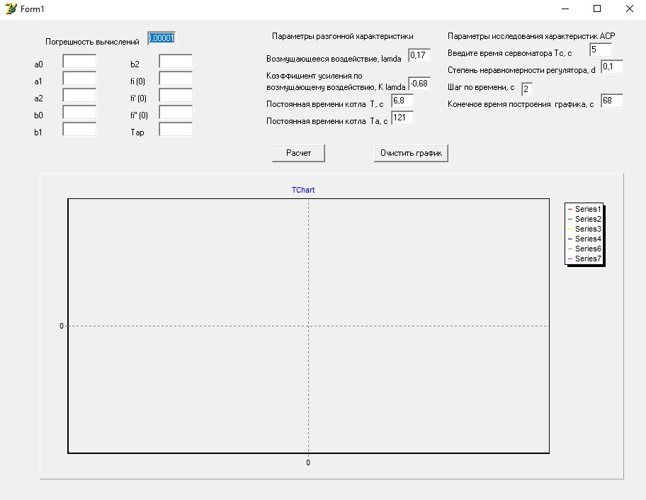

# Learning Simulate (Delphi) - Water level regulator

Demo

The program is designed to simulate the operation of the water level regulator in the steam drum of the boiler.

1. Regulator settings and indicators of the dynamic characteristics of the boiler are taken as initial data.
2. The simulation is implemented based on the calculation of a 3rd order differential equation.
3. The simulation results are displayed in the form of graphs and in files indicating the settings of the controller "d_Tc.txt"
 
Demo jpg 
 
